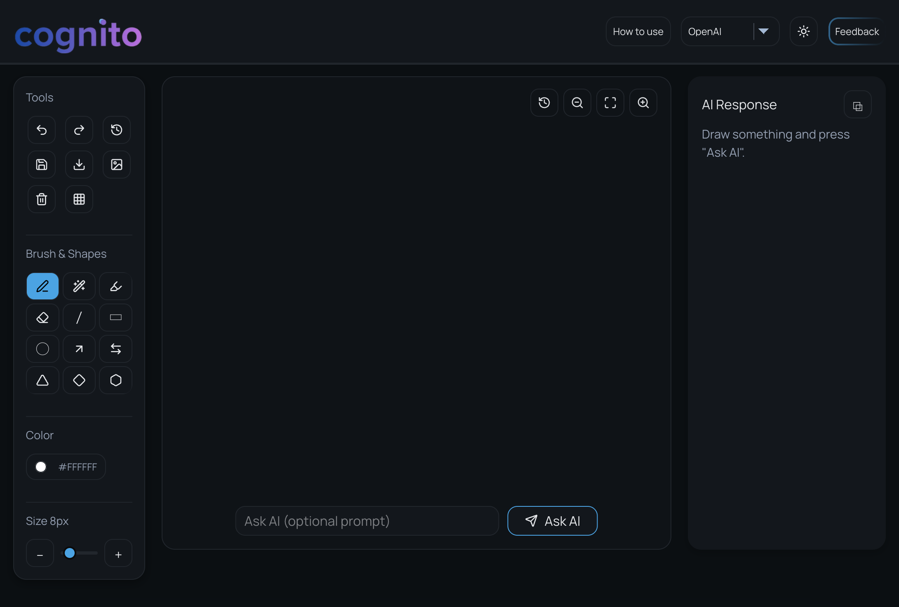
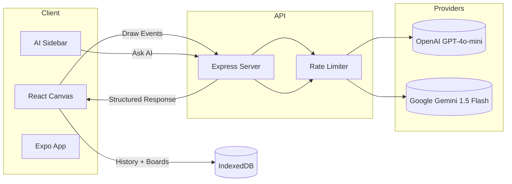
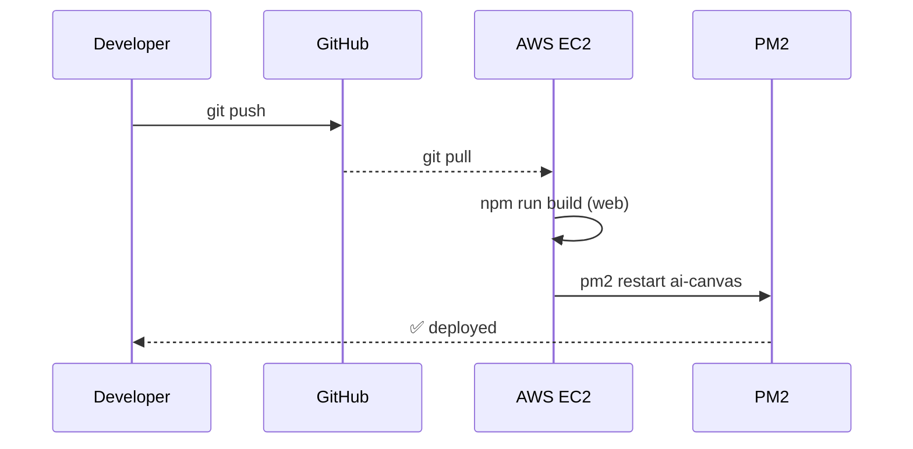

<div align="center">


<h1>AI Canvas Lab</h1>
<p>Sketch. Solve. Describe. A modern, themeable canvas with AI assistance for web, native, and static deployments.</p>


[](https://opensource.org/licenses/MIT)
[](https://aws.amazon.com/)

</div>

## 🚀 Highlights

| What | Why it matters |
| --- | --- |
| **All-in-one AI canvas** | Draw freehand, drop shapes, or paste screenshots—then ask OpenAI or Gemini to explain, summarise, or solve problems directly on the board. |
| **Smart text blocks** | Create, move, resize, and live-edit text fields with auto-wrapping and keyboard shortcuts, just like a design tool. |
| **Time-travel history** | Unlimited undo/redo, named snapshots, and a visual timeline so experimentation is frictionless. |
| **Zero-config local dev** | `npm run dev` for the frontend, `npm run dev` for the server—no monorepo gymnastics. |
| **Production ready** | Secure Express API with rate limiting, CORS, dotenv, and deploy scripts for AWS, Render, Netlify, etc. |

## 📊 Snapshot Dashboard

| Metric | Value |
| --- | --- |
| Supported tools | 18 brushes/shapes + smart text |
| AI providers | OpenAI GPT-4o-mini, Google Gemini 1.5 Flash |
| Max canvas size | Unlimited (vector history with streaming) |
| Undo capacity | 60 named snapshots (configurable) |
| Default rate limit | 10 requests / 24h / IP |
| Supported deploy targets | AWS EC2, Netlify, Render, Vercel, Railway, Fly.io |

## 📸 Screenshots

<div align="center">

### Canvas Interface


*Modern canvas with drawing tools, AI analysis panel, and theme toggle*

### AI Analysis


*Real-time AI analysis of sketches with structured output*

</div>

## 🧱 Architecture Overview



<details>
<summary><strong>🛰️ Deployment Flow (click to expand)</strong></summary>



</details>

## ✨ Features

<details>
<summary><strong>🎨 Drawing & Canvas</strong></summary>

### 🎨 Drawing & Canvas
- **Multi-layer Canvas System** - Background, drawing, and overlay layers for complex compositions
- **Brush Tools** - Brush, Marker, Highlighter, and Eraser with adjustable size (1-64px)
- **Shape Tools** - Line, Rectangle, Ellipse, Arrow, Double Arrow, Triangle, Diamond, Hexagon
- **Smart Text Fields** - Add, move, resize, edit, and auto-wrap text blocks with resize handles *or* sidebar sliders
- **Custom Color Picker** - Full color palette with custom color selection
- **Pressure Sensitivity** - Support for pressure-sensitive input devices
- **Smooth Stroke Rendering** - Optimized canvas rendering with anti-aliasing
- **Grid System** - Optional grid overlay for precise alignment
- **Zoom & Pan** - Mouse wheel zoom (0.5x - 5x) and pan with space+drag
- **Touch Gestures** - Pinch-to-zoom and multi-touch support for mobile devices
</details>

<details>
<summary><strong>🔄 History & Undo</strong></summary>

### 🔄 History & Undo
- **Unlimited Undo/Redo** - Full history stack with keyboard shortcuts
- **History Timeline** - Visual timeline of canvas states
- **Named Snapshots** - Save and label specific canvas states
- **History Navigation** - Jump to any point in history
- **Auto-save** - Automatic history persistence in IndexedDB
</details>

<details>
<summary><strong>📤 Export & Import</strong></summary>

### 📤 Export & Import
- **PNG Export** - High-resolution PNG export with transparent background
- **Image Upload** - Drag-and-drop or file upload to background layer
- **Board Persistence** - Save and load boards from local storage
- **JSON Export** - Export canvas data as JSON for backup/restore
</details>

<details>
<summary><strong>🤖 AI Integration</strong></summary>

### 🤖 AI Integration
- **Dual AI Providers** - Switch between OpenAI (GPT-4o-mini) and Google Gemini
- **Image Analysis** - Upload sketches and get AI-powered insights
- **Structured Output** - Formatted responses with sections (Title, Details, Steps, Answer, Tips)
- **Custom Prompts** - Optional text prompts for specific analysis
- **Response Parsing** - Intelligent parsing of AI responses into structured format
- **Clipboard Copy** - One-click copy of AI responses
- **Animated Feedback** - Visual indicators during AI processing
</details>

<details>
<summary><strong>🎯 User Experience</strong></summary>

### 🎯 User Experience
- **Light/Dark Theme** - System-aware theme with manual toggle
- **Theme Persistence** - Theme preference saved in localStorage
- **Responsive Design** - Works on desktop, tablet, and mobile devices
- **Keyboard Shortcuts** - Full keyboard navigation support
- **Accessibility** - ARIA labels and keyboard-first workflow
- **Performance Optimized** - Minimal re-renders and efficient canvas updates
</details>

<details>
<summary><strong>🔒 Security & Performance</strong></summary>

### 🔒 Security & Performance
- **API Key Protection** - All API keys stored server-side, never exposed to client
- **Rate Limiting** - Configurable rate limits per IP (default: 10 requests/24h)
- **Payload Validation** - Strict validation of image data URLs
- **CORS Protection** - Configurable origin allow-list
- **Security Headers** - Helmet.js for secure HTTP headers
- **Compression** - Gzip/deflate response compression
- **Image Size Limits** - Configurable maximum image size (default: 8MB)
</details>

<details>
<summary><strong>🚀 Deployment Options</strong></summary>

### 🚀 Deployment Options
- **Web** - Deploy to Netlify, Vercel, Cloudflare Pages, or any static host
- **API** - Deploy backend to Render, Railway, Fly.io, or AWS EC2
- **Mobile** - Expo/React Native app for Android and iOS
- **Static** - Standalone HTML version for quick demos
</details>

## 🛠️ Tech Stack

### Frontend
- **React 18.3** - UI framework with hooks and modern patterns
- **TypeScript 5.6** - Type-safe development
- **Vite 5.4** - Fast build tool and dev server
- **Lucide React** - Beautiful icon library
- **Canvas API** - Native HTML5 canvas for drawing
- **IndexedDB** - Client-side storage for board persistence

### Backend
- **Node.js 20+** - Runtime environment
- **Express 4.19** - Web framework
- **dotenv** - Environment variable management
- **Helmet** - Security headers middleware
- **CORS** - Cross-origin resource sharing
- **express-rate-limit** - Rate limiting middleware
- **compression** - Response compression

### AI Providers
- **OpenAI API** - GPT-4o-mini for image analysis
- **Google Gemini** - Gemini 1.5 Flash for alternative analysis

### Mobile
- **Expo** - React Native framework
- **React Native Skia** - High-performance canvas rendering

### DevOps & Deployment
- **AWS EC2** - Cloud hosting with secure secret management
- **AWS Secrets Manager** - Secure environment variable storage
- **PM2** - Process manager for Node.js
- **GitHub Actions** - CI/CD (optional)

## 📋 Table of Contents
- [Overview](#overview)
- [Snapshot Dashboard](#-snapshot-dashboard)
- [Architecture Overview](#-architecture-overview)
- [Screenshots](#-screenshots)
- [Features](#-features)
- [Tech Stack](#️-tech-stack)
- [Quick Start](#-quick-start)
- [Installation](#-installation)
- [Configuration](#-configuration)
- [Deployment](#-deployment)
- [Usage Guide](#-usage-guide)
- [API Reference](#-api-reference)
- [Security](#-security)
- [Contributing](#-contributing)
- [License](#-license)

## 🎯 Overview

AI Canvas Lab (codename Cognito) is a cross-platform whiteboard application that combines powerful drawing tools with AI-powered analysis. This is only the **first prototype**, focused on validating the experience of sketching, annotating, and asking AI for instant help. Whether you're solving math, drafting UI diagrams, or preparing classroom notes, Cognito bridges pen-and-paper workflows with modern AI.

### Key Capabilities
- **Sketch & Draw** - Professional-grade drawing tools with multiple brush types and shapes
- **AI Analysis** - Get instant analysis of your sketches from OpenAI or Google Gemini
- **Math Solving** - Upload math problems and get step-by-step solutions
- **Diagram Analysis** - Understand and improve UI wireframes and diagrams
- **Note Taking** - Capture ideas with AI-powered summarization

## 📚 Use Cases & Integrations

| Scenario | How Cognito helps |
| --- | --- |
| **Student note-taking** | Drop class diagrams, handwrite formulas, then ask AI to summarize, explain, or quiz you. |
| **LMS/EdTech integration** | Embed the canvas so students can make notes, collaborate, and access AI feedback right inside your platform. |
| **Team retros & brainstorms** | Capture messy whiteboard sessions, then generate structured summaries, action items, and TODOs. |
| **Design critiques** | Annotate UI screenshots and let AI describe pain points or suggest improvements. |

> We’re also planning deeper document workflows: import PDFs, write on them, run AI analysis with reference data, and keep everything organized by tags, date, and category.

## 🚀 Quick Start

<details open>
<summary><strong>Show Quick Start steps</strong></summary>

### Prerequisites
- Node.js ≥ 20
- npm ≥ 10
- OpenAI API key and/or Google Gemini API key

> **TL;DR**
> ```bash
> git clone https://github.com/rohansonawane/cognito.git
> cd cognito
> (cd server && npm install && cp .env.example .env && npm run dev)
> (cd web && npm install && npm run dev)
> ```
> Visit **http://localhost:5173** and start sketching.

### 1. Clone the Repository
```bash
git clone https://github.com/rohansonawane/cognito.git
cd cognito
```

### 2. Setup Backend
```bash
cd server
npm install
cp .env.example .env
# Edit .env and add your API keys
npm start
```

### 3. Setup Frontend
```bash
cd ../web
npm install
npm run dev
```

Visit `http://localhost:5173` to start drawing!
</details>

## 📦 Installation

<details>
<summary><strong>Expand installation commands</strong></summary>

### Local Development

#### Backend Server
```bash
cd server
npm install
cp .env.example .env
# Add OPENAI_API_KEY and/or GEMINI_API_KEY to .env
npm run start  # Production mode
npm run dev    # Watch mode with auto-reload
```

#### Frontend Web App
```bash
cd web
npm install
npm run dev    # Development server at http://localhost:5173
npm run build  # Production build
npm run preview # Preview production build
```

#### Mobile App (Optional)
```bash
cd mobile
npm install
export SERVER_URL="http://your-server-ip:8787"
npm run android  # For Android
npm run ios      # For iOS
```
</details>

## ⚙️ Configuration

<details>
<summary><strong>Expand configuration references</strong></summary>

### Server Environment Variables

Create `server/.env` with the following variables:

| Variable | Required | Default | Description |
|----------|----------|---------|-------------|
| `OPENAI_API_KEY` | Yes* | — | OpenAI API key for GPT-4o-mini |
| `GEMINI_API_KEY` | Yes* | — | Google Gemini API key |
| `CORS_ORIGIN` | No | `*` | Comma-separated allowed origins |
| `PORT` | No | `8787` | Server port |
| `MAX_IMAGE_MB` | No | `8` | Maximum image size in MB |
| `RATE_LIMIT_WINDOW_MS` | No | `86400000` | Rate limit window (24h) |
| `RATE_LIMIT_MAX` | No | `10` | Max requests per window |
| `GEMINI_MODEL` | No | `gemini-1.5-flash-latest` | Gemini model name |
| `GEMINI_API_VERSION` | No | `v1beta` | Gemini API version |
| `GEMINI_API_BASE` | No | `https://generativelanguage.googleapis.com` | Gemini API base URL |

*At least one AI provider key is required.

### Client Configuration

- **Web**: Provider selection and theme persist in `localStorage`
- **Mobile**: Set `SERVER_URL` in `app.config.ts` or via environment variable
- **Static**: Configure `window.APP_CONFIG.aiEndpoint` in `index.html`
</details>

## 🚢 Deployment

<details>
<summary><strong>Show deployment recipes</strong></summary>

### AWS EC2 (Recommended for Production)

#### Quick Deploy
```bash
# 1. Upload secrets to AWS Secrets Manager
./scripts/upload-secret-to-aws.sh

# 2. Deploy application
./scripts/deploy-to-aws-ec2.sh
```

#### Manual Setup
1. **Create IAM Role** with `SecretsManagerReadWrite` permission
2. **Attach role to EC2 instance**
3. **Run setup script**:
   ```bash
   ./setup-ec2-secure.sh
   ```

### Render (API Backend)
1. Connect your GitHub repository
2. Select `render.yaml` blueprint
3. Add environment variables in dashboard
4. Deploy!

### Netlify (Web Frontend)
1. Connect repository
2. Build command: `cd web && npm install && npm run build`
3. Publish directory: `web/dist`
4. Add `SERVER_URL` environment variable

### Other Platforms
- **Vercel**: Deploy `web/` directory
- **Railway**: Use `railway.json` configuration
- **Fly.io**: Use `fly.toml` configuration
</details>

## 📖 Usage Guide

<details>
<summary><strong>Expand usage guide</strong></summary>

### Drawing Tools

#### Brush Tools
- **Brush** - Standard drawing tool with smooth strokes
- **Marker** - Bold, opaque strokes
- **Highlighter** - Semi-transparent strokes for highlighting
- **Eraser** - Remove parts of your drawing

#### Shape Tools
- **Line** - Straight lines
- **Rectangle** - Rectangles and squares
- **Ellipse** - Circles and ovals
- **Arrow** - Single-direction arrows
- **Double Arrow** - Bidirectional arrows
- **Triangle** - Triangular shapes
- **Diamond** - Diamond/rhombus shapes
- **Hexagon** - Hexagonal shapes

#### Controls
- **Color Picker** - Click to select from palette or use custom color picker
- **Size Slider** - Adjust brush/shape size from 1px to 64px
- **Zoom** - Mouse wheel or zoom buttons (0.5x - 5x)
- **Pan** - Hold Space + drag, or use touch gestures

### Keyboard Shortcuts

| Shortcut | Action |
|----------|--------|
| `Ctrl/Cmd + Z` | Undo |
| `Ctrl/Cmd + Shift + Z` | Redo |
| `Ctrl/Cmd + S` | Save board |
| `Ctrl/Cmd + E` | Export PNG |
| `Space + Drag` | Pan canvas |
| `Mouse Wheel` | Zoom in/out |
| `+` / `-` | Zoom in/out |
| `0` | Reset zoom |
| `Delete` | Clear canvas |

### AI Analysis

1. **Draw or upload** your sketch/image
2. **Click "Ask AI"** button
3. **Select provider** (OpenAI or Gemini)
4. **Optional**: Add a custom prompt
5. **View results** in the side panel
6. **Copy** response to clipboard

### Board Management

- **Save Board** - Saves to local storage with auto-naming
- **Load Board** - Restore from saved boards
- **History Timeline** - View and navigate canvas history
- **Export PNG** - Download canvas as image
- **Clear Canvas** - Reset to blank canvas
</details>

## 🧪 Troubleshooting & Support

| Issue | Fix |
| --- | --- |
| AI requests fail | Confirm provider API keys, check rate limits, and verify server logs. |
| Cursor feels offset after zooming | Refresh the page; the brush cursor now recalculates using world coordinates—if it persists, ensure no browser extensions are injecting overlays. |
| Mobile gestures lag | Disable unnecessary animations in settings, or reduce brush size for lower memory devices. |
| Deployment errors | Run `npm run build` in both `server/` and `web/`, then restart PM2; check `pm2 logs ai-canvas`. |

Need help? Open an issue with screenshots/logs and we’ll respond quickly.

## 🔌 API Reference

<details>
<summary><strong>Expand API reference</strong></summary>

### Endpoints

#### `GET /api/health`
Health check endpoint.

**Response:**
```json
{
  "ok": true
}
```

#### `POST /api/analyze`
Analyze an image with AI.

**Request:**
```json
{
  "image": "data:image/png;base64,...",
  "provider": "openai" | "gemini",
  "prompt": "Optional custom prompt"
}
```

**Response:**
```json
{
  "ok": true,
  "message": "Structured AI response text"
}
```

**Error Response:**
```json
{
  "ok": false,
  "error": "Error message"
}
```

### Rate Limits
- Default: 10 requests per IP per 24 hours
- Configurable via `RATE_LIMIT_MAX` and `RATE_LIMIT_WINDOW_MS`
</details>

## 🔒 Security

<details>
<summary><strong>Expand security checklist</strong></summary>

### Server-Side Security
- ✅ API keys never exposed to client
- ✅ Rate limiting per IP address
- ✅ CORS origin validation
- ✅ Image payload validation (MIME type, size)
- ✅ Security headers via Helmet.js
- ✅ Request compression

### Client-Side Security
- ✅ No API keys in client code
- ✅ Secure localStorage usage
- ✅ XSS protection
- ✅ Content Security Policy ready

### AWS Deployment Security
- ✅ Secrets stored in AWS Secrets Manager
- ✅ IAM roles for authentication (no access keys)
- ✅ Encrypted secrets at rest
- ✅ CloudTrail audit logging
</details>

## 🗂️ Project Management

We track work publicly through:

- **Issues** for bugs, enhancements, and documentation tasks.
- **Milestones** aligned to prototypes and releases (e.g., “Prototype v1”, “Notebook Beta”).
- **Project Board** grouping backlog → in progress → review → done.

Want to influence the roadmap? Comment on open issues or start a discussion—community feedback guides what we tackle next.

## 🔮 Future Roadmap

The current release is our *first prototype*. Here’s what’s planned:

- **UI/UX polish**: smoother gestures, richer theming, contextual toolbars.
- **More LLM models**: Anthropic Claude, Azure OpenAI, plus bring-your-own endpoint.
- **Performance & security**: optimized canvas diffing, stricter CSP, audit logging.
- **User accounts & dashboards**: sign-in, recent boards, analytics.
- **Notebooks**: persistent spaces to save boards, tag them, and reopen anytime.
- **Native apps**: dedicated Android & iOS clients with offline mode.
- **Document workflows**: import PDFs/Docs, annotate inline, process with AI, and cite sections in responses.
- **Contextual references**: upload doc packs so AI answers only from provided materials.
- **Learning loops**: AI adapts to user corrections; optional personalization.
- **Sharing & collaboration**: share notes, teachers broadcasting boards to students, note sorting by category/date, comments.
- **Immersive/VR mode**: render the canvas inside virtual classrooms or labs.
- **Local/Custom LLMs**: integrate on-device or self-hosted models for private deployments.

💡 **Use case spotlight**: Embed Cognito in your LMS so students can take AI-assisted notes, share them with classmates, and even receive teacher feedback—all in one place.

## 🤝 Contributing

We welcome code, docs, design ideas, and research notes! Here’s how to contribute:

1. **Open an issue** for bugs, feature requests, or UX proposals.
2. **Fork** the repo and create a branch (`git checkout -b feature/amazing`).
3. **Commit** with clear messages and add tests when possible.
4. **Open a Pull Request** describing the change and screenshots/gifs if UI-related.
5. **Join the discussion** in issues or start new ones—suggestions and Q&A are encouraged.

### Code of Conduct (Summary)

We are committed to a respectful, inclusive environment. Be kind, assume positive intent, and report any harassment via GitHub issues or email. Full details are in [CODE_OF_CONDUCT.md](CODE_OF_CONDUCT.md) (add your contact info there if missing).

## 📄 License

MIT License - see [LICENSE](LICENSE) file for details.

Copyright © 2024 Cognito

---

<div align="center">

**Made with ❤️ by the Cognito team**

[Report Bug](https://github.com/rohansonawane/cognito/issues) · [Request Feature](https://github.com/rohansonawane/cognito/issues) · [Documentation](https://github.com/rohansonawane/cognito#readme)

</div>
