<div align="center">


<h1>AI Canvas Lab</h1>
<p>Sketch. Solve. Describe. A modern, themeable canvas with AI assistance for web, native, and static deployments.</p>


[](https://opensource.org/licenses/MIT)
[](https://aws.amazon.com/)

</div>

## 🚀 Highlights

| What | Why it matters |
| --- | --- |
| **All-in-one AI canvas** | Draw freehand, drop shapes, or paste screenshots—then ask OpenAI or Gemini to explain, summarise, or solve problems directly on the board. |
| **Smart text blocks** | Create, move, resize, and live-edit text fields with auto-wrapping and keyboard shortcuts, just like a design tool. |
| **Time-travel history** | Unlimited undo/redo, named snapshots, and a visual timeline so experimentation is frictionless. |
| **Zero-config local dev** | `npm run dev` for the frontend, `npm run dev` for the server—no monorepo gymnastics. |
| **Production ready** | Secure Express API with rate limiting, CORS, dotenv, and deploy scripts for AWS, Render, Netlify, etc. |

> **Prototype status:** this is our first public prototype. Expect rapid iterations, UI/UX polish, and frequent new features based on community feedback.

## 📸 Screenshots

<div align="center">

### Canvas Interface


*Modern canvas with drawing tools, AI analysis panel, and theme toggle*

### AI Analysis


*Real-time AI analysis of sketches with structured output*

</div>

## 🧱 Architecture Overview


<details>
<summary><strong>🛰️ Deployment Flow (click to expand)</strong></summary>



</details>

```mermaid
sequenceDiagram
    participant Dev as Developer
    participant GH as GitHub
    participant EC2 as AWS EC2
    participant PM2 as PM2

    Dev->>GH: git push
    GH-->>EC2: git pull
    EC2->>EC2: npm run build (web)
    EC2->>PM2: pm2 restart ai-canvas
    PM2-->>Dev: ✅ deployed
```

## 🔭 Future Roadmap

We’re actively shaping Cognito, and the following upgrades are on deck:

- 🎨 **Better UI/UX**: refined toolbars, accessible color themes, collaborative cursors.
- 🧠 **More LLMs**: plug in additional hosted or local models (Llama, Mistral, custom fine-tunes).
- ⚡ **Performance**: leaner rendering pipeline, smarter caching, lower memory footprint.
- 👤 **User accounts & dashboards**: personal spaces, saved canvases, analytics, and sharing controls.
- 📓 **Notebooks**: structured collections where users can save boards, reflections, and AI responses.
- 📱 **Native apps**: Android & iOS builds via Expo for offline-friendly sketching.
- 🔒 **Security & compliance**: granular roles, audit logs, encryption at rest, SSO options.
- 🗂 **Document workflows**: upload PDFs/notes, annotate them, run AI analyses with citations to supplied files.
- 🧷 **Knowledge grounding**: “reference packs” so AI answers cite the documents or lessons you attach.
- 🧾 **Learning insights**: personalized suggestions as the system learns from user patterns (opt-in).
- 🔁 **Sharing & sorting**: categories, tags, and smart filters so teachers can distribute sets of notes to a class.
- 🎓 **Classroom mode**: teachers broadcast boards to students, collect submissions, or review collaboratively.
- 🕶 **Immersive whiteboarding**: experimental VR workspace for live sketching in 3D classrooms.
- 🧱 **Bring-your-own LLM**: run Cognito against your self-hosted or on-prem model for full data control.

If any of these excite you, feel free to open an issue or PR to help shape them!

## 📚 Use Cases & Integrations

- **Student note-taking companion**: Embed Cognito into your LMS or classroom portal so students can take handwritten notes, annotate diagrams, and query AI without switching tabs.
- **Team knowledge canvas**: Product and engineering teams can brainstorm flows, mark up screenshots, then capture AI-generated summaries to share.
- **Document overlay (coming soon)**: Drop PDFs or slides, write directly on top, and send context to AI—including references so answers stay grounded in provided material.
- **Learning systems**: Cognito can learn from user sessions (with consent) to tailor prompts, suggest templates, and recommend next steps.
- **Sharing & organization**: Notes can be shared with classmates, teachers, or teammates with categories, tags, and date filters for easy retrieval.
- **Extended platforms**: Roadmap includes teacher broadcast mode, VR collaboration, mobile apps, and optional on-device or self-hosted LLMs for privacy-first deployments.

## ✨ Features

<details>
<summary><strong>🎨 Drawing & Canvas</strong></summary>

### 🎨 Drawing & Canvas
- **Multi-layer Canvas System** - Background, drawing, and overlay layers for complex compositions
- **Brush Tools** - Brush, Marker, Highlighter, and Eraser with adjustable size (1-64px)
- **Shape Tools** - Line, Rectangle, Ellipse, Arrow, Double Arrow, Triangle, Diamond, Hexagon
- **Smart Text Fields** - Add, move, resize, edit, and auto-wrap text blocks with resize handles *or* sidebar sliders
- **Custom Color Picker** - Full color palette with custom color selection
- **Pressure Sensitivity** - Support for pressure-sensitive input devices
- **Smooth Stroke Rendering** - Optimized canvas rendering with anti-aliasing
- **Grid System** - Optional grid overlay for precise alignment
- **Zoom & Pan** - Mouse wheel zoom (0.5x - 5x) and pan with space+drag
- **Touch Gestures** - Pinch-to-zoom and multi-touch support for mobile devices
</details>

<details>
<summary><strong>🔄 History & Undo</strong></summary>

### 🔄 History & Undo
- **Unlimited Undo/Redo** - Full history stack with keyboard shortcuts
- **History Timeline** - Visual timeline of canvas states
- **Named Snapshots** - Save and label specific canvas states
- **History Navigation** - Jump to any point in history
- **Auto-save** - Automatic history persistence in IndexedDB
</details>

<details>
<summary><strong>📤 Export & Import</strong></summary>

### 📤 Export & Import
- **PNG Export** - High-resolution PNG export with transparent background
- **Image Upload** - Drag-and-drop or file upload to background layer
- **Board Persistence** - Save and load boards from local storage
- **JSON Export** - Export canvas data as JSON for backup/restore
</details>

<details>
<summary><strong>🤖 AI Integration</strong></summary>

### 🤖 AI Integration
- **Dual AI Providers** - Switch between OpenAI (GPT-4o-mini) and Google Gemini
- **Image Analysis** - Upload sketches and get AI-powered insights
- **Structured Output** - Formatted responses with sections (Title, Details, Steps, Answer, Tips)
- **Custom Prompts** - Optional text prompts for specific analysis
- **Response Parsing** - Intelligent parsing of AI responses into structured format
- **Clipboard Copy** - One-click copy of AI responses
- **Animated Feedback** - Visual indicators during AI processing
</details>

<details>
<summary><strong>🎯 User Experience</strong></summary>

### 🎯 User Experience
- **Light/Dark Theme** - System-aware theme with manual toggle
- **Theme Persistence** - Theme preference saved in localStorage
- **Responsive Design** - Works on desktop, tablet, and mobile devices
- **Keyboard Shortcuts** - Full keyboard navigation support
- **Accessibility** - ARIA labels and keyboard-first workflow
- **Performance Optimized** - Minimal re-renders and efficient canvas updates
</details>

<details>
<summary><strong>🔒 Security & Performance</strong></summary>

### 🔒 Security & Performance
- **API Key Protection** - All API keys stored server-side, never exposed to client
- **Rate Limiting** - Configurable rate limits per IP (default: 10 requests/24h)
- **Payload Validation** - Strict validation of image data URLs
- **CORS Protection** - Configurable origin allow-list
- **Security Headers** - Helmet.js for secure HTTP headers
- **Compression** - Gzip/deflate response compression
- **Image Size Limits** - Configurable maximum image size (default: 8MB)
</details>

<details>
<summary><strong>🚀 Deployment Options</strong></summary>

### 🚀 Deployment Options
- **Web** - Deploy to Netlify, Vercel, Cloudflare Pages, or any static host
- **API** - Deploy backend to Render, Railway, Fly.io, or AWS EC2
- **Mobile** - Expo/React Native app for Android and iOS
- **Static** - Standalone HTML version for quick demos
</details>

## 🛠️ Tech Stack

### Frontend
- **React 18.3** - UI framework with hooks and modern patterns
- **TypeScript 5.6** - Type-safe development
- **Vite 5.4** - Fast build tool and dev server
- **Lucide React** - Beautiful icon library
- **Canvas API** - Native HTML5 canvas for drawing
- **IndexedDB** - Client-side storage for board persistence

### Backend
- **Node.js 20+** - Runtime environment
- **Express 4.19** - Web framework
- **dotenv** - Environment variable management
- **Helmet** - Security headers middleware
- **CORS** - Cross-origin resource sharing
- **express-rate-limit** - Rate limiting middleware
- **compression** - Response compression

### AI Providers
- **OpenAI API** - GPT-4o-mini for image analysis
- **Google Gemini** - Gemini 1.5 Flash for alternative analysis

### Mobile
- **Expo** - React Native framework
- **React Native Skia** - High-performance canvas rendering

### DevOps & Deployment
- **AWS EC2** - Cloud hosting with secure secret management
- **AWS Secrets Manager** - Secure environment variable storage
- **PM2** - Process manager for Node.js
- **GitHub Actions** - CI/CD (optional)

## 📋 Table of Contents
- [Overview](#-overview)
- [Architecture Overview](#-architecture-overview)
- [Screenshots](#-screenshots)
- [Use Cases & Integrations](#-use-cases--integrations)
- [Features](#-features)
- [Tech Stack](#️-tech-stack)
- [Quick Start](#-quick-start)
- [Installation](#-installation)
- [Configuration](#-configuration)
- [Deployment](#-deployment)
- [Usage Guide](#-usage-guide)
- [Future Roadmap](#-future-roadmap)
- [API Reference](#-api-reference)
- [Security](#-security)
- [Contributing](#-contributing)
- [License](#-license)

## 🎯 Overview

AI Canvas Lab (codename Cognito) is a cross-platform whiteboard application that combines powerful drawing tools with AI-powered analysis. Whether you're sketching diagrams, solving math problems, or creating wireframes, the AI can provide insights, explanations, and solutions.

### Key Capabilities
- **Sketch & Draw** - Professional-grade drawing tools with multiple brush types and shapes
- **AI Analysis** - Get instant analysis of your sketches from OpenAI or Google Gemini
- **Math Solving** - Upload math problems and get step-by-step solutions
- **Diagram Analysis** - Understand and improve UI wireframes and diagrams
- **Note Taking** - Capture ideas with AI-powered summarization

## 🚀 Quick Start

<details open>
<summary><strong>Show Quick Start steps</strong></summary>

### Prerequisites
- Node.js ≥ 20
- npm ≥ 10
- OpenAI API key and/or Google Gemini API key

> **TL;DR**
> ```bash
> git clone https://github.com/rohansonawane/cognito.git
> cd cognito
> (cd server && npm install && cp .env.example .env && npm run dev)
> (cd web && npm install && npm run dev)
> ```
> Visit **http://localhost:5173** and start sketching.

### 1. Clone the Repository
```bash
git clone https://github.com/rohansonawane/cognito.git
cd cognito
```

### 2. Setup Backend
```bash
cd server
npm install
cp .env.example .env
# Edit .env and add your API keys
npm start
```

### 3. Setup Frontend
```bash
cd ../web
npm install
npm run dev
```

Visit `http://localhost:5173` to start drawing!
</details>

## 📦 Installation

<details>
<summary><strong>Expand installation commands</strong></summary>

### Local Development

#### Backend Server
```bash
cd server
npm install
cp .env.example .env
# Add OPENAI_API_KEY and/or GEMINI_API_KEY to .env
npm run start  # Production mode
npm run dev    # Watch mode with auto-reload
```

#### Frontend Web App
```bash
cd web
npm install
npm run dev    # Development server at http://localhost:5173
npm run build  # Production build
npm run preview # Preview production build
```

#### Mobile App (Optional)
```bash
cd mobile
npm install
export SERVER_URL="http://your-server-ip:8787"
npm run android  # For Android
npm run ios      # For iOS
```
</details>

## ⚙️ Configuration

<details>
<summary><strong>Expand configuration references</strong></summary>

### Server Environment Variables

Create `server/.env` with the following variables:

| Variable | Required | Default | Description |
|----------|----------|---------|-------------|
| `OPENAI_API_KEY` | Yes* | — | OpenAI API key for GPT-4o-mini |
| `GEMINI_API_KEY` | Yes* | — | Google Gemini API key |
| `CORS_ORIGIN` | No | `*` | Comma-separated allowed origins |
| `PORT` | No | `8787` | Server port |
| `MAX_IMAGE_MB` | No | `8` | Maximum image size in MB |
| `RATE_LIMIT_WINDOW_MS` | No | `86400000` | Rate limit window (24h) |
| `RATE_LIMIT_MAX` | No | `10` | Max requests per window |
| `GEMINI_MODEL` | No | `gemini-1.5-flash-latest` | Gemini model name |
| `GEMINI_API_VERSION` | No | `v1beta` | Gemini API version |
| `GEMINI_API_BASE` | No | `https://generativelanguage.googleapis.com` | Gemini API base URL |

*At least one AI provider key is required.

### Client Configuration

- **Web**: Provider selection and theme persist in `localStorage`
- **Mobile**: Set `SERVER_URL` in `app.config.ts` or via environment variable
- **Static**: Configure `window.APP_CONFIG.aiEndpoint` in `index.html`
</details>

## 🚢 Deployment

<details>
<summary><strong>Show deployment recipes</strong></summary>

### AWS EC2 (Recommended for Production)

#### Quick Deploy
```bash
# 1. Upload secrets to AWS Secrets Manager
./scripts/upload-secret-to-aws.sh

# 2. Deploy application
./scripts/deploy-to-aws-ec2.sh
```

#### Manual Setup
1. **Create IAM Role** with `SecretsManagerReadWrite` permission
2. **Attach role to EC2 instance**
3. **Run setup script**:
   ```bash
   ./setup-ec2-secure.sh
   ```

### Render (API Backend)
1. Connect your GitHub repository
2. Select `render.yaml` blueprint
3. Add environment variables in dashboard
4. Deploy!

### Netlify (Web Frontend)
1. Connect repository
2. Build command: `cd web && npm install && npm run build`
3. Publish directory: `web/dist`
4. Add `SERVER_URL` environment variable

### Other Platforms
- **Vercel**: Deploy `web/` directory
- **Railway**: Use `railway.json` configuration
- **Fly.io**: Use `fly.toml` configuration
</details>

## 📖 Usage Guide

<details>
<summary><strong>Expand usage guide</strong></summary>

### Drawing Tools

#### Brush Tools
- **Brush** - Standard drawing tool with smooth strokes
- **Marker** - Bold, opaque strokes
- **Highlighter** - Semi-transparent strokes for highlighting
- **Eraser** - Remove parts of your drawing

#### Shape Tools
- **Line** - Straight lines
- **Rectangle** - Rectangles and squares
- **Ellipse** - Circles and ovals
- **Arrow** - Single-direction arrows
- **Double Arrow** - Bidirectional arrows
- **Triangle** - Triangular shapes
- **Diamond** - Diamond/rhombus shapes
- **Hexagon** - Hexagonal shapes

#### Controls
- **Color Picker** - Click to select from palette or use custom color picker
- **Size Slider** - Adjust brush/shape size from 1px to 64px
- **Zoom** - Mouse wheel or zoom buttons (0.5x - 5x)
- **Pan** - Hold Space + drag, or use touch gestures

### Keyboard Shortcuts

| Shortcut | Action |
|----------|--------|
| `Ctrl/Cmd + Z` | Undo |
| `Ctrl/Cmd + Shift + Z` | Redo |
| `Ctrl/Cmd + S` | Save board |
| `Ctrl/Cmd + E` | Export PNG |
| `Space + Drag` | Pan canvas |
| `Mouse Wheel` | Zoom in/out |
| `+` / `-` | Zoom in/out |
| `0` | Reset zoom |
| `Delete` | Clear canvas |

### AI Analysis

1. **Draw or upload** your sketch/image
2. **Click "Ask AI"** button
3. **Select provider** (OpenAI or Gemini)
4. **Optional**: Add a custom prompt
5. **View results** in the side panel
6. **Copy** response to clipboard

### Board Management

- **Save Board** - Saves to local storage with auto-naming
- **Load Board** - Restore from saved boards
- **History Timeline** - View and navigate canvas history
- **Export PNG** - Download canvas as image
- **Clear Canvas** - Reset to blank canvas
</details>

## 🔌 API Reference

<details>
<summary><strong>Expand API reference</strong></summary>

### Endpoints

#### `GET /api/health`
Health check endpoint.

**Response:**
```json
{
  "ok": true
}
```

#### `POST /api/analyze`
Analyze an image with AI.

**Request:**
```json
{
  "image": "data:image/png;base64,...",
  "provider": "openai" | "gemini",
  "prompt": "Optional custom prompt"
}
```

**Response:**
```json
{
  "ok": true,
  "message": "Structured AI response text"
}
```

**Error Response:**
```json
{
  "ok": false,
  "error": "Error message"
}
```

### Rate Limits
- Default: 10 requests per IP per 24 hours
- Configurable via `RATE_LIMIT_MAX` and `RATE_LIMIT_WINDOW_MS`
</details>

## 🔒 Security

<details>
<summary><strong>Expand security checklist</strong></summary>

### Server-Side Security
- ✅ API keys never exposed to client
- ✅ Rate limiting per IP address
- ✅ CORS origin validation
- ✅ Image payload validation (MIME type, size)
- ✅ Security headers via Helmet.js
- ✅ Request compression

### Client-Side Security
- ✅ No API keys in client code
- ✅ Secure localStorage usage
- ✅ XSS protection
- ✅ Content Security Policy ready

### AWS Deployment Security
- ✅ Secrets stored in AWS Secrets Manager
- ✅ IAM roles for authentication (no access keys)
- ✅ Encrypted secrets at rest
- ✅ CloudTrail audit logging
</details>

## 🤝 Contributing

We love collaborating with educators, engineers, and curious makers. Here’s how you can help:

- **Issues**: Spot a bug, rough edge, or idea? Open an issue with as much detail as possible.
- **Pull requests**: Fork the repo, create a feature branch (`git checkout -b feature/awesome`), commit, and open a PR. Screenshots or Loom demos are extra helpful.
- **Discussions**: Not sure where something fits? Start a discussion or drop a note in the relevant issue.
- **Docs & translations**: Improve guides, translate UI copy, or add tutorials—documentation PRs are always welcome.

### Code of Conduct

Please help us keep the community welcoming. Be respectful, assume good intent, and avoid harassment or discrimination of any kind. By contributing, you agree to follow our Code of Conduct (if you don’t see `CODE_OF_CONDUCT.md` yet, treat this section as our interim pledge—one is on the roadmap).


## 📄 License

MIT License - see [LICENSE](LICENSE) file for details.

Copyright © 2024 Cognito

---

<div align="center">

**Made with ❤️ by the Cognito team**

[Report Bug](https://github.com/rohansonawane/cognito/issues) · [Request Feature](https://github.com/rohansonawane/cognito/issues) · [Documentation](https://github.com/rohansonawane/cognito#readme)

</div>
